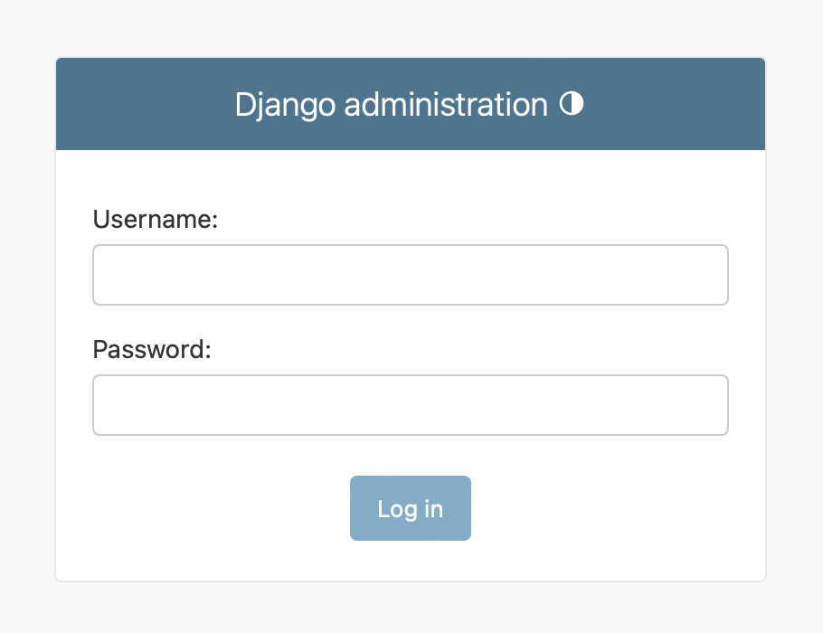
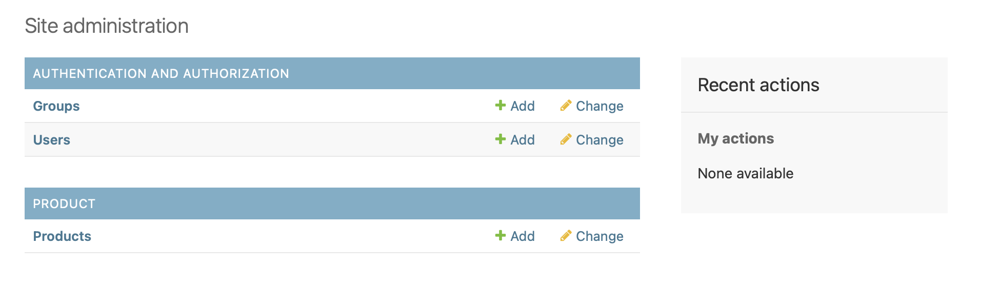
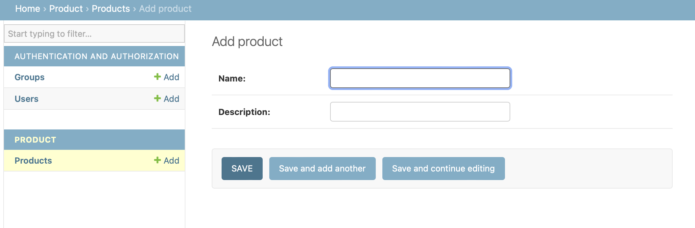

# Homebase take home assignemnt

## Table of Contents

1. [Prerequisites](#prerequisites)
2. [Getting Started](#getting-started)
3. [Documentation](#documentation)

## Prerequisites

Check if the following is installed on your local machine

### **python3**

```sh
python --version
```

If not installed, follow this [guide](https://realpython.com/installing-python/) to install Python3.

### **pip**

```sh
pip --version
```

pip is usually preinstalled with most Python distributions. However, if you don't have pip, refer to this [guide](https://pip.pypa.io/en/stable/installation/) to install pip.

### **node and npm**

```sh
node -v
npm -v
```

If not installed, follow this [guide](https://docs.npmjs.com/downloading-and-installing-node-js-and-npm) to install npm.

## Getting Started

Follow these steps to get your project up and running:

1. **Clone the Repository:**

```sh
git clone https://github.com/vdlphm/homebase-tha.git
```

2. **Start Node server:**

Open terminal in the same folder you clone the repositiry and run the following command:

```sh
cd user-be
npm install
npm start run
```

3. **Start proxy server:**

Open a new terminal in the same folder you clone the repositiry and run the following command:

```sh
cd proxy

TARGET_HOST=localhost TARGET_PORT=3000 HOST=localhost PORT=8080 python3 main.py
```

4. **Start Django server:**:

Open a new terminal in the same folder you clone the repositiry and run the following command:

```sh
cd djangoBe

python -m venv venv

source venv/bin/activate

pip install -r requirement.txt

python manage.py migrate

python manage.py createsuperuser

TARGET_HOST=localhost TARGET_PORT=8080 python manage.py runserver
```

## Documentation

### User

Checkout [docs](http://localhost:3000/doc/#/) to see documentation. Please start node server (step 2 in [Getting started](#getting-started)) beforehand. The operations are the same accross NodeJS, proxy and Django, just need to replace the host address to use.

## Product

1. **Go to admin site:**
   Once Django is started, it will print its address. Use that address with `/admin/` to login.

```
Starting development server at http://127.0.0.1:8000/
```

In this case, go to [http://127.0.0.1:8000/admin/](http://127.0.0.1:8000/admin/) to login.



2. **CRUD product using interface:**

Once logged in, you can see a Product section. You can click into it to perform operation.




